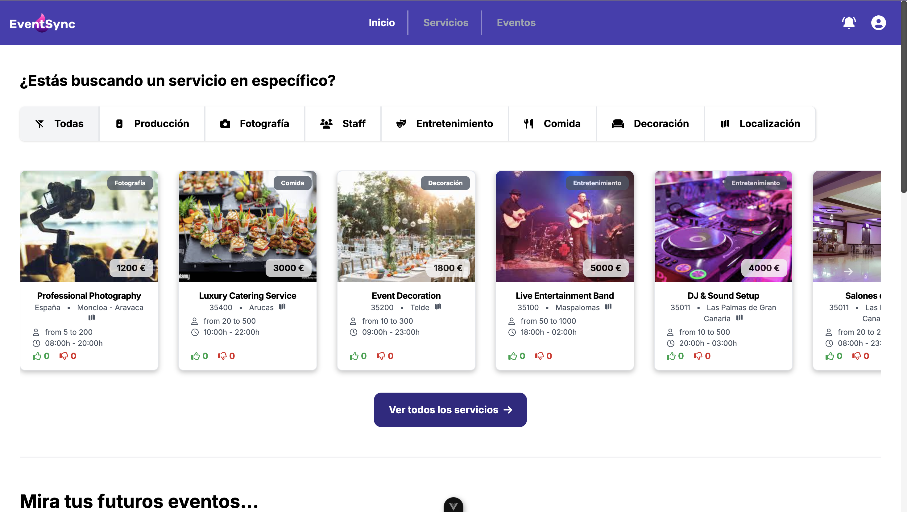

# EventSync

EventSync is a web application that simplifies the process of searching for event services, creating events, managing reservations, and tracking event budgets. With EventSync, you can easily plan and organize your events, ensuring a smooth experience for both event organizers and service providers.

## Table of Contents
- [Usage](#usage)
- [Prerequisites](#prerequisites)
- [Installation](#installation)
- [Author](#author)
- [Technologies Used](#technologies-used)
- [Contributing](#contributing)
- [Project Link](#project-link)
- [License](#license)
- [Web Preview](#web-preview)

## Usage

- User registration and login.
- Home page showcasing service offers and user reviews.
- Event creation with title, date, and time.
- Service selection and request submission.
- Service owner approval and pricing integration with the event.
- Total price calculation and expense tracking.
- Summary page displaying selected services and total cost.
- Guest list management.

## Prerequisites
To run this application, make sure you have the back-end of the app:
```
https://github.com/gcarolina03/eventSync-backend
```

Start the backend server with the following command: **`npm start`**

## Installation
To install and run the front-end app locally, follow these steps:

1. Clone this repository to your local machine.
2. **Set up Google Maps API**
  - Go to the [Google Cloud Console](https://console.cloud.google.com/).
  - Create a new project (or select an existing one).
  - Navigate to **APIs & Services > Library**, and search for **Maps JavaScript API**.
  - Enable the **Maps JavaScript API** and other APIs you might need (e.g., **Geocoding API**, **Places API**).
  - Go to **APIs & Services > Credentials**, then create a new API Key under **Create Credentials**.
  - Copy the API key.
3. **Run the `setup.sh` script**
  - This script will set up all the necessary environment variables and install the required dependencies.
  - Make sure the script has execution permissions:
    ```bash
    chmod +x setup.sh
    ```
  - Then, execute the script to configure your environment and install dependencies:
    ```bash
    ./setup.sh
    ```
  - During execution, the script will ask for the following credentials:
    - **Google Maps API Key**, paste the **Google Maps API Key** when prompted.

  This script will create a `.env` file and install project dependencies.
4. **Start the development server**
   - After the configurations are executed, you can start the development server using the following command:
     ```bash
     npm run dev
     ```
   - The app will now be running at **`http://localhost:5173`**.

After completing these steps, you should have both the front-end and backend of EventSync app up and running locally.

## Author
EventSync was created by:

- Carolina (https://github.com/gcarolina03)

## Technologies Used
- **Vue 3**: A progressive framework for building user interfaces.
- **Tailwind CSS**: A utility-first CSS framework for building responsive designs.
- **Pinia**: A library for state management in Vue applications.
- **Axios**: A JavaScript library for making HTTP requests from the frontend to the backend server and connecting to the database.
- **Socket.io**: A library for real-time communication.
- **Vee-Validate & Yup**: Libraries for form validation.
- **Vue I18n**: A library for internationalizing Vue applications.

## Contributing
If you would like to contribute to EventSync, please submit a pull request with your changes. We welcome contributions of all kinds, including bug fixes, feature additions, and general improvements.

## Project Link
You can find the project on GitHub at: https://github.com/gcarolina03/eventSync-frontend-Vue

## License
This project is licensed under the [MIT License](LICENSE).

## Web Preview
